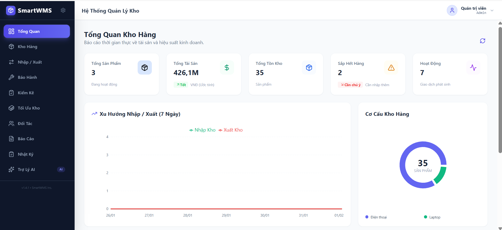

# 📦 SmartWMS - Hệ Thống Quản Lý Kho Hàng Công Nghệ Thông Minh


**SmartWMS** là giải pháp quản lý kho hàng hiện đại được thiết kế chuyên biệt cho các **Cửa hàng Công nghệ (Laptop, Điện thoại, Phụ kiện)**. Hệ thống giải quyết bài toán quản lý định danh (IMEI/Serial), quy trình bảo hành phức tạp và tích hợp **Trí tuệ nhân tạo (Google Gemini AI)** để hỗ trợ ra quyết định kinh doanh.

---

## 🚀 Tính Năng Nổi Bật

### 1. 📱 Quản lý Kho & Sản phẩm Chuyên sâu
- **Đặc thù ngành hàng:** Quản lý sản phẩm với cấu hình chi tiết (CPU, RAM, Ổ cứng, Màu sắc, Dung lượng).
- **Quản lý IMEI/Serial:** Theo dõi tồn kho theo từng mã định danh thiết bị, ngăn chặn thất thoát và tráo đổi hàng hóa.
- **Phân loại đa cấp:** Quản lý theo Danh mục (Laptop, Phone...) và Thương hiệu (Brand).
- **In Tem Mã Vạch:** Tích hợp tạo và in tem QR Code dán sản phẩm trực tiếp từ trình duyệt.

### 2. 🔄 Nghiệp vụ Nhập / Xuất & Truy vết
- **Quy trình chuẩn:** Tạo phiếu Nhập/Xuất có chọn Đối tác (NCC/Khách hàng).
- **Validate thông minh:** Kiểm tra trùng lặp IMEI khi nhập và kiểm tra tồn kho khi xuất.
- **Traceability (Truy xuất nguồn gốc):** Tra cứu lịch sử vòng đời của một thiết bị bất kỳ (Ngày nhập -> Ngày bán -> Lịch sử bảo hành) thông qua IMEI.
- **Kiểm kê kho (Stocktake):** Hỗ trợ chế độ Đếm mù (Blind count) và quét mã QR tốc độ cao.

### 3. 🔧 Dịch vụ Hậu mãi & Tài chính
- **Quản lý Bảo hành:** Quy trình khép kín: Tiếp nhận -> Kiểm tra -> Sửa chữa -> Tính phí -> Trả khách.
- **Quản lý Đối tác:** Lưu trữ thông tin Nhà cung cấp và Khách hàng.
- **Sổ quỹ (Finance):** Quản lý dòng tiền Thu/Chi, tự động tính toán quỹ tiền mặt hiện tại.

### 4. 🧠 Trợ lý ảo AI (Powered by Google Gemini)
- **Health Check:** Tự động phân tích dữ liệu, phát hiện hàng tồn kho lâu, hàng sắp hết.
- **Dự báo nhu cầu:** Phân tích xu hướng bán hàng 30 ngày qua để gợi ý số lượng nhập hàng cho tháng tới.
- **Chatbot thông minh:** Hỏi đáp số liệu kho (Doanh thu, Tồn kho, Lịch sử) bằng ngôn ngữ tự nhiên tiếng Việt.

### 5. 🛡️ Hệ thống & Bảo mật
- **Dashboard trực quan:** Biểu đồ doanh thu, cơ cấu kho, Top sản phẩm bán chạy (Recharts).
- **Phân quyền (RBAC):**
    - **Admin:** Toàn quyền hệ thống.
    - **Manager:** Xem báo cáo, AI, Sổ quỹ.
    - **Staff:** Thao tác kho, bảo hành (Không được xóa dữ liệu).
- **Audit Log:** Ghi nhật ký mọi thao tác (Ai? Làm gì? Lúc nào?) để tra soát.
- **Báo cáo:** Xuất file Excel chuẩn kế toán (Tồn kho, Nhật ký Nhập xuất).

---

## 🛠️ Công Nghệ Sử Dụng

### Frontend (Client)
- **Core:** ReactJS (Vite), TypeScript.
- **UI/Styling:** Tailwind CSS, Lucide React (Icons).
- **Data Fetching:** Axios (với Interceptors xử lý Token).
- **Visualization:** Recharts (Biểu đồ).
- **Utilities:**
    - `react-to-print`: In ấn phiếu/tem.
    - `html5-qrcode`: Quét mã vạch bằng Camera.
    - `qrcode.react`: Tạo mã QR.

### Backend (Server)
- **Core:** Python 3.10+, FastAPI (Asynchronous).
- **Database:** MongoDB (NoSQL).
- **ODM:** Beanie (Async ODM for MongoDB).
- **Security:** JWT (JSON Web Token), Passlib (Bcrypt hashing).
- **AI:** Google Generative AI SDK (Gemini 2.5 Flash).
- **Data Processing:** Pandas, Xlsxwriter (Xử lý Excel).

---

## ⚙️ Hướng Dẫn Cài Đặt & Triển Khai

### 1. Yêu cầu tiên quyết
- Node.js (v18 trở lên).
- Python (v3.10 trở lên).
- MongoDB (đang chạy ở cổng 27017).

### 2. Cài đặt Backend

```bash
cd server

# 1. Tạo môi trường ảo
python -m venv venv

# 2. Kích hoạt môi trường
# Windows:
.\venv\Scripts\activate
# Mac/Linux:
source venv/bin/activate

# 3. Cài đặt thư viện
pip install -r requirements.txt

# 4. Cấu hình biến môi trường (Xem phần dưới)

# 5. Chạy Server
uvicorn app:app --reload
```

### 3. Cài đặt Frontend

```bash
cd client

# 1. Cài đặt thư viện
npm install

# 2. Chạy ứng dụng
npm run dev
```

### 🔑 Cấu Hình Biến Môi Trường (.env)
Tạo file .env trong thư mục server/ và điền các thông tin sau:
```
env
# Kết nối Database
MONGO_URL=mongodb://localhost:27017
DB_NAME=warehouse

# Bảo mật (Thay đổi chuỗi này khi deploy thực tế)
SECRET_KEY=chuoi_bi_mat_sieu_kho_doan_cua_ban_vui_long_thay_doi

# Google Gemini AI Key (Lấy miễn phí tại: aistudio.google.com)
GOOGLE_API_KEY=AIzaSyDxxxxxxxxxxxxxxxxxxxxxxxxxxxx

# Cấu hình Email (Tùy chọn - Nếu dùng tính năng gửi mail cảnh báo)
MAIL_USERNAME=your_email@gmail.com
MAIL_PASSWORD=your_app_password
ADMIN_EMAIL=admin_email@gmail.com
```

### 🚀 Khởi Tạo Dữ Liệu Mẫu (Seeding)
Khi chạy lần đầu, database sẽ trống. Hãy thực hiện bước sau để tạo tài khoản Admin và dữ liệu mẫu:
Đảm bảo Backend và MongoDB đang chạy.
Mở trình duyệt truy cập: http://127.0.0.1:8000/api/seed
Hệ thống sẽ thông báo tạo thành công.
Tài khoản mặc định:
Username: admin
Password: 123456

### 📂 Cấu Trúc Thư Mục
```
text
SmartWMS/
├── client/                 # Frontend ReactJS
│   ├── src/
│   │   ├── components/     # Các thành phần giao diện (Inventory, Dashboard...)
│   │   ├── hooks/          # Custom Hooks (useAuth)
│   │   ├── services/       # API Services (Axios configuration)
│   │   └── types/          # TypeScript Interfaces
│   └── ...
├── server/                 # Backend FastAPI
│   ├── app.py              # File chính (Routes, Config)
│   ├── models.py           # Database Models (Beanie/Pydantic)
│   ├── auth.py             # Logic xác thực (JWT, Hashing)
│   ├── ai_service.py       # Logic xử lý AI (Gemini)
│   ├── log_service.py      # Logic ghi Audit Log
│   └── ...
└── README.md
```

### 📸 Hình Ảnh Minh Họa

| Dashboard | Kho Hàng |
|:---:|:---:|
|  |  |

| Trợ Lý AI | Lịch Sử IMEI |
|:---:|:---:|
|  |  |

### 🤝 Đóng Góp
Dự án này được xây dựng với mục đích học tập và nghiên cứu. Mọi đóng góp, báo lỗi hoặc yêu cầu tính năng đều được hoan nghênh. Vui lòng tạo Issue hoặc Pull Request.
